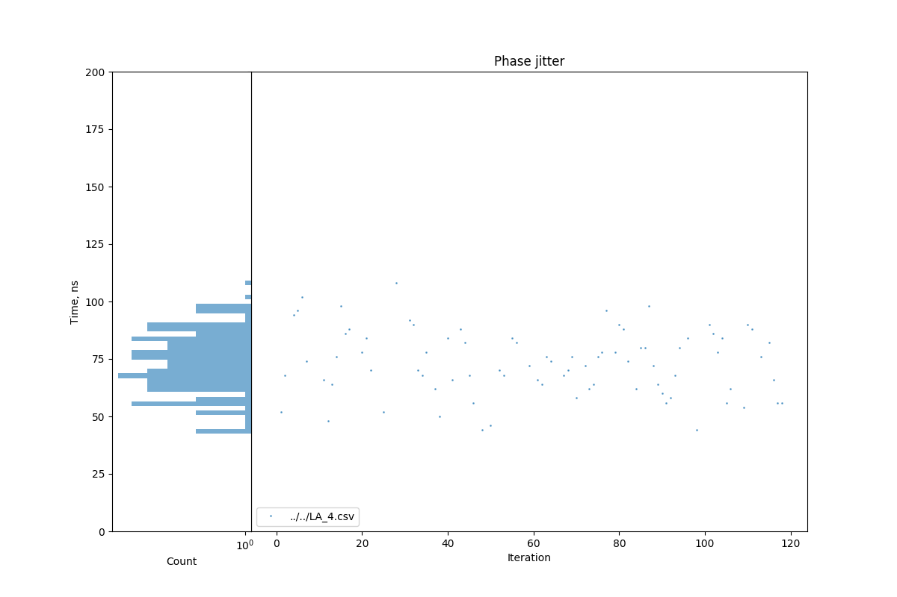

# tcc_ethernet_timestamps_sample

This sample is a simple example program that demonstrates how Intel platform features 
can improve time synchronization quality between the system clock (CLOCK_REALTIME) and 
a Precision Time Protocol Hardware Clock (PHC). The sample uses a Time-Aware GPIO 
(TGPIO) pin to generate single pulses and the pulse per second (PPS) pin of a network 
controller to generate periodic signal.

**Note:** Samples are intended to demonstrate how to write code using certain features. They are not performance benchmarks. Example output shown here is for illustration only. Your output may vary.

## Source Files

 File | Description
 ---- | -----------
 [main.c](src/main.c)| Main file containing sample

## Example Command

1. Run the synchronization script:
```
tcc_ethernet_sample_start_synchronization
```
Example output:
```
Ethernet interface name: eth2

Starting ptp4l...
ptp4l[1370.895] selected /dev/ptp3 as PTP clock
ptp4l[1370.906] port 1: INITIALIZING to LISTENING on INIT_COMPLETE
ptp4l[1370.907] port 0: INITIALIZING to LISTENING on INIT_COMPLETE
ptp4l[1370.907] port 1: LISTENING to MASTER on ANNOUNCE_RECEIPT_TIMEOUT_EXPIRES
ptp4l[1370.907] selected local clock 88abcd.fffe.110123 as best master
ptp4l[1370.907] port 1: assuming the grand master role

PTP device: /dev/ptp3

Starting ph2sys...
Use Ctrl+C to exit.

phc2sys[1376.912]: /dev/ptp3 sys offset   1094843 s0 freq -293962 delay      0
phc2sys[1377.913]: /dev/ptp3 sys offset   1095927 s1 freq -292879 delay      0
phc2sys[1378.914]: /dev/ptp3 sys offset       -30 s2 freq -292909 delay      0
phc2sys[1379.914]: /dev/ptp3 sys offset       -24 s2 freq -292912 delay      0
phc2sys[1380.914]: /dev/ptp3 sys offset       -19 s2 freq -292914 delay      0
phc2sys[1381.925]: /dev/ptp3 sys offset        -2 s2 freq -292902 delay      0
```

2. Wait for synchronization by observing the values in the phc2sys output. When the values stop getting smaller, synchronization is complete.

3. In the second terminal window, run the sample to start signal generation. Use "PTP device" from the synchronization script output as PTP device (/dev/ptp3 here):
```
tcc_ethernet_timestamps_sample -t /dev/ptp0 1 -p /dev/ptp3 0 -T 1000000000
```
Example output:
```
Started PPS signal generation. Pin/channel 0, period 1000000000 nsec
To interrupt, use Ctrl+C

Generated single pulse on TGPIO. Start time: 196177158691ns
Generated single pulse on TGPIO. Start time: 196677158643ns
Generated single pulse on TGPIO. Start time: 197177158629ns
Generated single pulse on TGPIO. Start time: 197677158615ns
Generated single pulse on TGPIO. Start time: 198177158601ns
```

4. Use a Logic Analyzer device to read values of two signals.

5. Export the measurement results as a CSV file:
```
Example (results.csv):

0.000000000000000, 0, 1
0.012241160000000, 0, 0
0.014060560000000, 1, 0
0.062242840000000, 1, 1
0.064062200000000, 0, 1
0.112244520000000, 0, 0
0.114063880000000, 1, 0
0.162246200000000, 1, 1
0.164065560000000, 0, 1
0.212247880000000, 0, 0
```

6. Run the signal analyzer script to plot the results.
```
cd samples/plot_scripts
./tcc_signal_analyzer_plotter.py results.csv --shift --units ns --output plot.png
```
Example output (plot.png):



## Command-Line Options
```
Usage:
tcc_ethernet_timestamps_sample --tgpio <device_name> [pin]
                               --pps <device_name> [pin]
                               [--period [value]]
                               [--verbose]
Options:
    -t | --tgpio      Specify the output TGPIO device (required) and pin index (optional). Default pin: 0.
    -p | --pps        Specify the output PPS device (required) and pin index (optional). Default pin: 0.
    -T | --period     Specify the output period in nanoseconds. Default: 1000000000 (1 second).
    -v | --verbose    Enable verbose output mode.

```

## Legal Information

Intel and the Intel logo are trademarks of Intel Corporation in the U.S. and/or other countries.

*Other names and brands may be claimed as the property of others.

Copyright Intel Corporation
